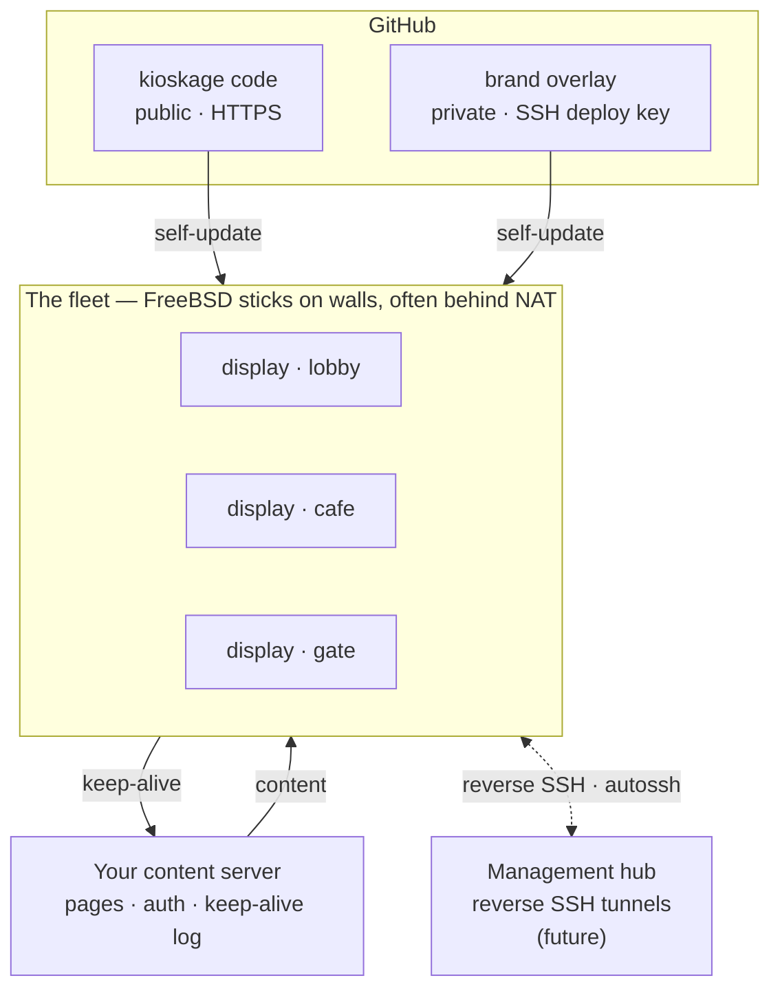

# Architecture

kioskage has three roles. **Only the first has to run FreeBSD.**

## The pieces

### 1. The sticks — the fleet

Cheap mini-PCs running FreeBSD, each driving **one screen**, full-screen Chromium,
no cursor, no chrome. A stick owns nothing but the display: it holds a saved
network, a content URL (or a kiosk key), and its identity. Everything else it
pulls. Sticks typically sit behind NAT on someone else's network — a shul, a
lobby, an office — so they reach *out*, never in.

### 2. Your content server

Anything that serves web pages over HTTP(S). The sticks fetch **their own
content** from it, and (optionally) validate a kiosk key and receive keep-alive
pings there. It's your infrastructure — kioskage never sees your content and
nothing phones home to the project.

### 3. The management hub — planned

A host the sticks dial out to over **reverse SSH** (held open with `autossh`), so
you can reach any display for maintenance even when it's behind NAT. This is the
one gap we hit in practice: a stick in the field with no inbound path. The hub
just needs an SSH server.

## The FreeBSD boundary

**Only the sticks need to run FreeBSD.** The content server and the management
hub can be anything with a web server (for content) and an SSH server (for the
tunnels) — Linux, BSD, a container, whatever you already run. We happen to run
FreeBSD on everything, but it isn't required.

## How a stick updates itself

Each stick self-updates nightly from **two repositories**:

| Repo | Visibility | Transport | Holds |
|------|-----------|-----------|-------|
| **code** (`kioskage`) | public | HTTPS, anonymous | the appliance — portal, services, kernel |
| **overlay** (yours) | private | SSH deploy key | `brand.conf`, logo, optional portal page |

GitHub deploy keys are unique per repository, which is exactly why the code repo
is **public** (anonymous HTTPS clone) and only the small overlay needs a key.

The updater (`kioskage-update`) fetches both, applies them, then **health-checks**
the result — the portal must answer on `:80`, and for a display update Xorg and
Chromium must come back. If the check fails, **both repos are reset to their last
revisions and re-applied**, so the running revision is always one that passed.

### Release channels

Sticks follow a channel via `KIOSKAGE_BRANCH`: **`prod`** (the fleet) or
**`staging`** (a few canaries). Push to `staging`, validate on the canaries, then
fast-forward `staging → prod` for everyone. The overlay is versioned on its own
branch (default `main`), independent of the code channel.

## Branding: code + overlay

The public code is fully generic — a neutral `brand.conf` and a plain logo. A
fleet's identity is **`{kioskage} + {your overlay}`**: the overlay's `brand.conf`
(product name, content URL base, setup SSID, colors, auth endpoint, keep-alive
domain) and logo are copied over the defaults at install and every OTA. Nothing
brand-specific lives in the code.

## Per-display content

A stick's content is either a full URL or a **kiosk key** that builds one:
`CONTENT_URL_BASE + "?key=<key>"`. So one fleet can drive a dozen different
screens — `lobby`, `cafe`, `gate` — each pointed at its own page on the same
content server.

## Fleet keep-alive

When the content URL is on the overlay's keep-alive domain, the stick appends its
hostname and deployed version to what it loads. Those turn up in your web
server's access log, so one line tells you **who's alive, on what build, and when
they last checked in** — no agent, no inbound connection. `tools/kiosk-status.sh`
renders that log into a fleet table.

## Authentication

The setup portal can be left open (grandfathered) or locked with a password, and
a kiosk key can be validated against your content server so a stick locks itself
and can still authenticate offline. See [AUTH.md](AUTH.md).

## Why FreeBSD on the sticks

- **Smaller footprint** than a typical Linux appliance — base system + a handful
  of packages, read-only root, ZFS.
- **A more unified distribution model** — one coherent base + `pkg`, versioned
  together, which makes the self-healing OTA and rollback simple to reason about.

The design should also **port to NetBSD** without much trouble — worth it if you
want to run even leaner or more exotic hardware. See the hardware notes on
[kioskage.org](https://kioskage.org).
